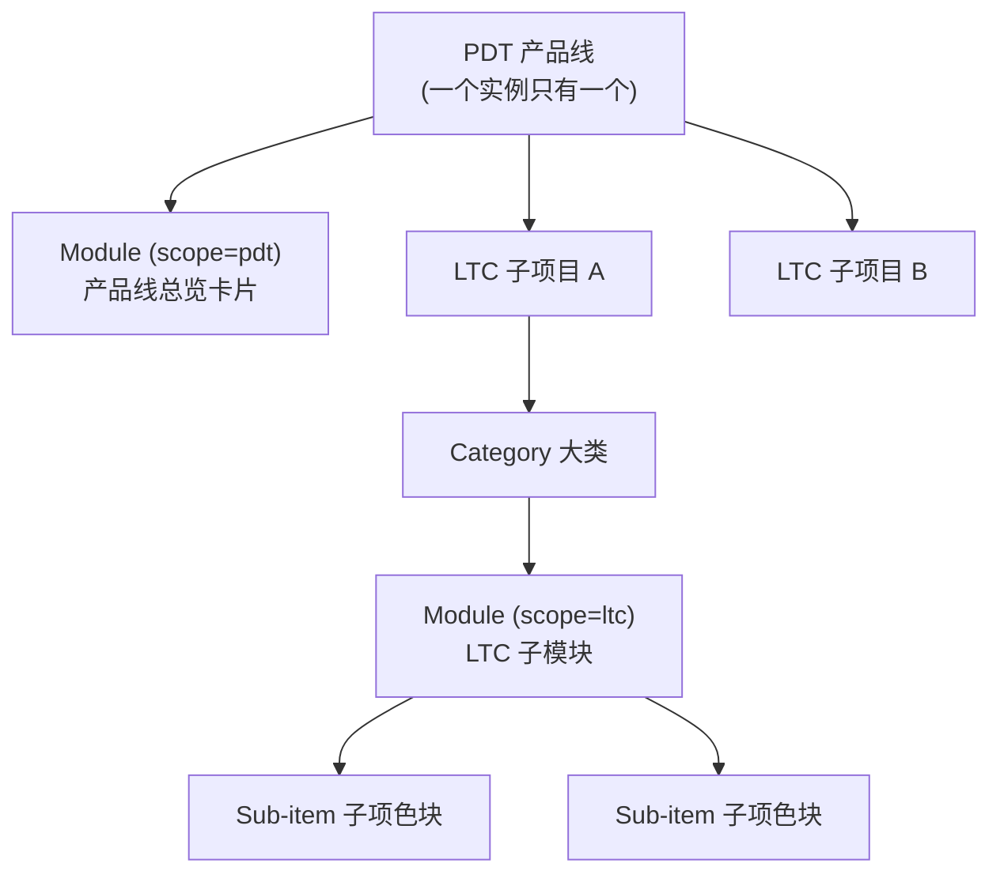
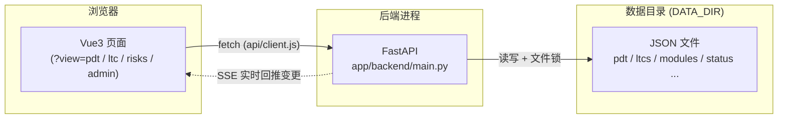
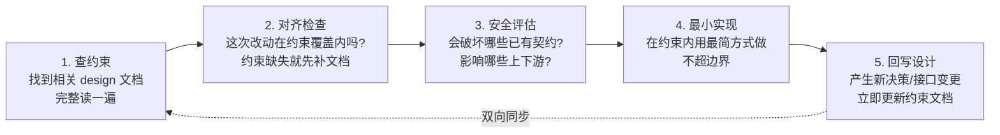
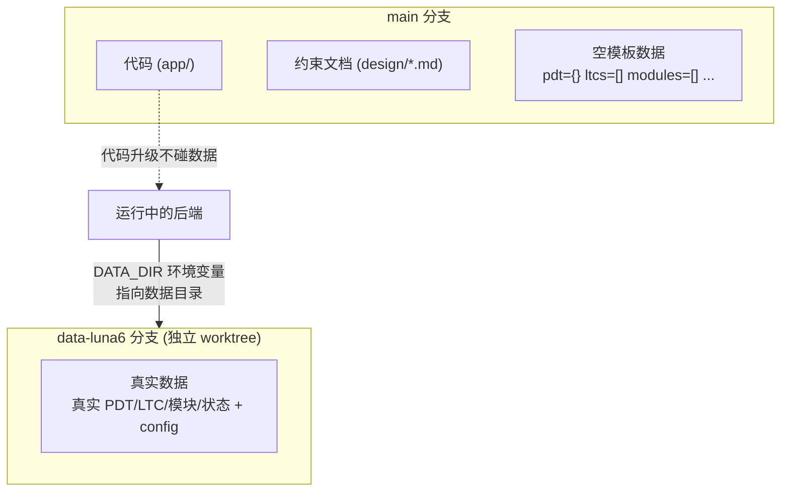
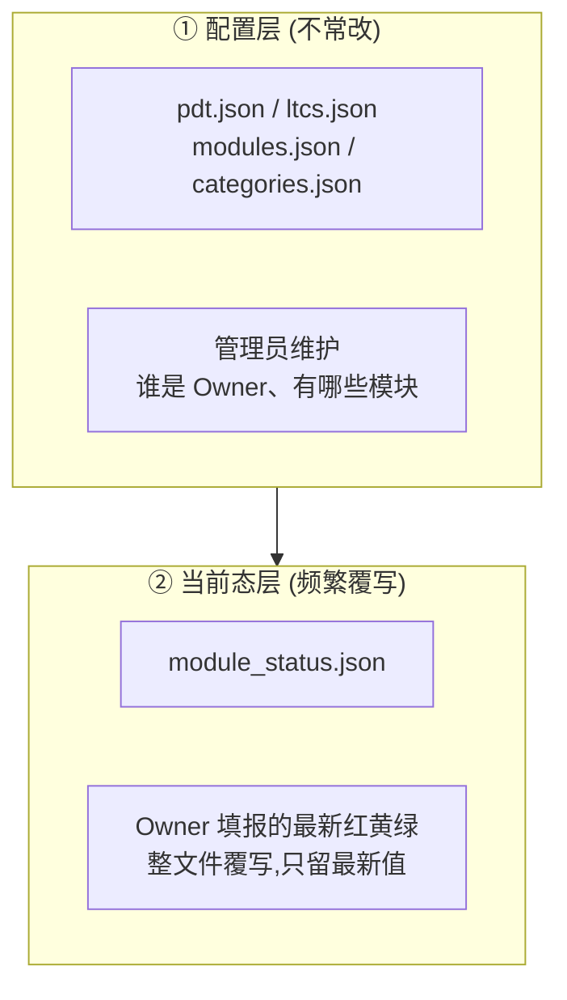
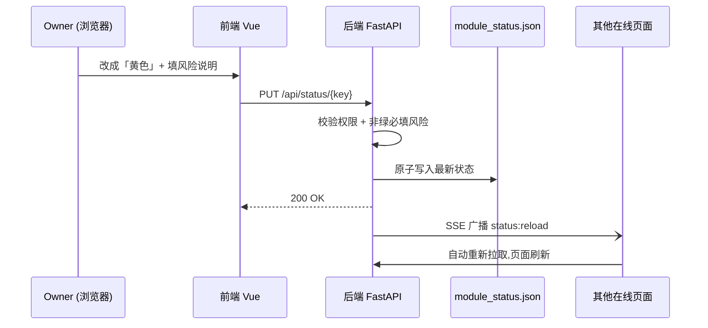
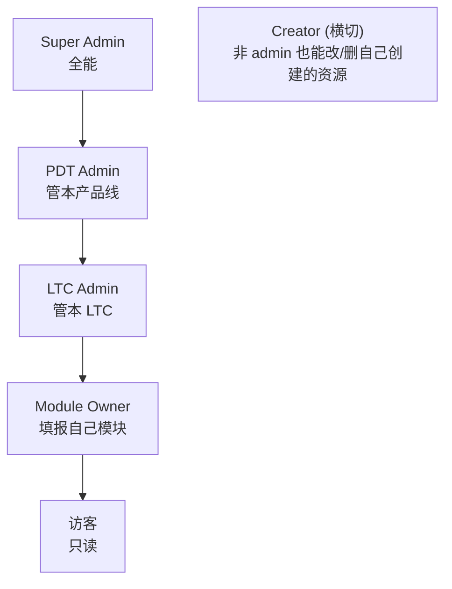

# PMD 项目交接文档

> 给接手 PMD（产品线项目看板系统）的新同学。读完这一篇，你应该能：跑起来、看懂整体设计、知道改东西该先看哪份约束文档、避开已知的坑。
>
> 本文是**导览**：讲脉络和核心设计决策，具体细节用链接指向 `design/` 下的约束文档，不重复抄写（抄了容易过期）。

---

## 0. 5 分钟速览

| 你想知道 | 一句话答案 |
|---------|-----------|
| 这是什么 | 一个**产品线项目看板**，给一条产品线（PDT）做进度可视化 |
| 技术栈 | 后端 FastAPI 单文件 + JSON 文件存储；前端 Vue3（无 Router/Pinia/UI 库） |
| 怎么跑 | `cd app && ./start.sh` → 浏览器开 `http://localhost:15173/?view=pdt` |
| 最特别的地方 | **约束先行（harness 工程）**：`design/` 下的文档是代码的「上位规则」，改代码前先查约束 |
| 数据存哪 | JSON 文件。**代码和数据分两个 git 分支**：`main` 存代码，`data-<实例>` 存真实数据 |
| 当前进度 | 核心功能全部完成、测试全绿；下一步是把首个真实实例 Luna 6 的数据正式落地（被飞书配置阻塞） |

**建议阅读路径**：本文从头读一遍 → 跑起来点一圈 → 读 `design/02`（全局大纲）和 `design/03`（数据分离）→ 之后按需查 `design/0X`。

---

## 1. 项目目标

PMD 解决一个具体问题：**一条产品线下面有很多子项目和模块，进度散在各处，没人能一眼看全，周会汇报靠手工拼 PPT。**

PMD 的做法：

1. 管理员搭好结构——配置好这条产品线（PDT）、下面的交付子项目（LTC）、每个模块的负责人（Owner）。
2. 负责人填报状态——每个 Owner 只填自己模块的状态，用**红 / 黄 / 绿**三色表达「正常 / 有风险 / 延期阻塞」，非绿必须写风险说明。
3. 大家看板——三类页面把状态可视化：产品线总览、子项目详情、风险汇总。

**一个部署实例只服务一条产品线**（一个 PDT）。多条产品线 = 多个独立部署。

> v1 的「做完」标准、整体设计理念见 → `design/02-项目看板系统全局设计大纲.md`

---

## 2. 核心概念（先记住这 5 个词）

| 术语 | 含义 | 类比 |
|------|------|------|
| **PDT** | Product Development Team，**产品线**（如 Multicam Pilot 3.0）。一个实例只服务一个 PDT | 一家「店」 |
| **LTC** | Lead To Cash，PDT 下的独立交付子项目（如某个客户项目「上汽 AS33」） | 店里的一个「项目」 |
| **Module** | 模块，看板的基本单元。`scope=pdt` 是产品线级总览卡片；`scope=ltc` 是某 LTC 下的子模块 | 项目里的一块「工作」 |
| **Sub-item** | LTC 模块下的子项色块（如「MCU 底软」模块下的 Autosar BSW、RTE） | 工作里的「小项」 |
| **Owner** | 模块负责人，只能填报自己模块的状态 | 这块工作的「责任人」 |

它们的层级关系：



> 还有第三种模块 `scope=ltc_template`——「模板池」，新建 LTC 时从它复制一份初始结构。详见 → `design/06-modules配置Schema约束.md`

---

## 3. 整体架构

一句话：**浏览器里的 Vue 页面，通过 API 调一个 FastAPI 后端，后端把数据读写到一堆 JSON 文件。** 没有数据库，没有微服务。



- 前端不直接碰数据，全走 API。
- 后端不直接被多人同时写坏——用**文件锁 + 原子写**保证一致性（见第 7、8 节）。
- 有人改了数据，后端通过 **SSE**（服务器推送）通知所有在线页面自动刷新，不用手动刷。

---

## 4. Harness 工程方法论（这个项目最不一样的地方）

### 4.1 为什么要这么干

普通项目是「先写代码，文档后补（或者不补）」。这个项目反过来：

> **`design/` 目录下的约束文档，是代码的「上位规则」。代码必须服从文档，不是文档描述代码。**

原因很现实：这个项目很多决策（数据怎么分层、颜色只能三种、权限怎么算、卡片不能复用两套）一旦写错，后面要返工或埋雷。所以**先把边界和禁止项定下来写进文档，再在边界内写代码**，让人（和 AI）都不容易跑偏。

### 4.2 强制工作流：改任何代码前必须走这五步



### 4.3 违规红线（碰了 = 盲改 / PR 拒收）

- ❌ 跳过第 1 步直接写代码（不查约束就动手）
- ❌ 代码和约束文档不一致（偏离约束必须先改文档说明原因）
- ❌ 只改代码不更新设计（新增接口 / 改数据模型 / 改组件职责 必须同步文档）
- ❌ 在 `main` 分支写入真实实例数据（见第 6 节）
- ❌ 新增写端点不补角色矩阵测试（见第 9 节）
- ❌ 前端 PDT 卡片和 LTC 卡片互相 import（见第 10 节）

### 4.4 兜底手段（现状要看清）

| 手段 | 作用 | 现状 |
|------|------|------|
| 角色权限矩阵测试 | 每个写端点 × 每类角色 的期望结果都有用例 | ✅ 已落地（`test_role_matrix.py`） |
| pre-commit 钩子 | 自动拦截往 main 写数据 | ⚠️ **文档里写了，但当前未安装**——现在靠人工纪律 |
| 数据校验脚本 `validate_data_files.py` | 校验数据文件结构 | ⚠️ **尚未实现**，是 Phase 14 的待办（见 `design/03` §8） |

> 根 `CLAUDE.md` 的「开发命令」里列了这两项，但目前仓库里没有——别照抄。详见第 11 节。

### 4.5 design/ 约束文档导览（按需查）

| 文档 | 讲什么 | 什么时候读 |
|------|--------|-----------|
| `01-设计文档编写约束` | 怎么写/维护 design 文档本身 | 改任何 design 文档前 |
| `02-项目看板系统全局设计大纲` | 系统全局架构、概念、v1 完成标准 | **入门必读** |
| `03-代码与数据分离约束` | main vs data 分支、worktree、DATA_DIR | **入门必读**，碰数据前 |
| `04-PDT与LTC管理规范` | PDT/LTC 命名、生命周期、里程碑、归档 | 改 PDT/LTC 逻辑前 |
| `05-模块与状态模型基础规则` | 模块/状态对应、颜色三态、数据不变量 | 改状态模型前 |
| `06-modules配置Schema约束` | modules.json / categories.json 字段规则 | 改模块结构前 |
| `07-module_status当前态Schema约束` | module_status.json 字段与校验 | 改状态字段前 |
| `10-权限与角色约束` | 五类角色、权限矩阵、判定函数 | **加任何写端点前必读** |
| `11-后端API约束` | FastAPI 技术栈、文件 IO、认证、SSE | 改后端前 |
| `12-前端实现约束` | Vue3 技术栈、UI 规范、状态管理 | 改前端前 |
| `13-页面编辑与展示约束` | 四类页面的展示/编辑/跳转规则 | 改页面交互前 |
| `14-AI边界与系统演进约束` | AI 能做/不能做什么、迁移规范、长期契约 | 用 AI 改项目前 |

路由总入口还有：`design/CLAUDE.md`、`app/CLAUDE.md`、`app/backend/CLAUDE.md`、`app/frontend/CLAUDE.md`——进对应目录前先读。

---

## 5. 代码与数据分离（重要，别搞混分支）

核心规则：**`main` 分支只放代码 + 空模板；真实数据放独立的 `data-<实例名>` 分支，通过 git worktree 挂到一起用。**



- 为什么这么分：**代码升级和实例数据互不污染**；同一套代码能服务多个产品线，各自一个 data 分支。
- 后端读写数据全部通过 `DATA_DIR` 环境变量定位目录，代码里没有硬编码路径。
- `data` 分支命名 `data-<实例名>`（如 `data-luna6`）。

### ⚠️ 当前的过渡特例（一定要知道）

按约束，`main` 应该是空模板。但**当前 `main` 分支上保留了首个实例 Luna 6 的真实数据**（`design/` 下的 `pdt.json` / `ltcs.json` / `modules.json` / `module_status.json` 都有真实内容）。

这是 `design/03` 和 `design/CLAUDE.md` 里**明确写明允许的「单 PDT 初期特例」**：项目还只有一个实例时，为了开发方便先放 main 上；**等引入第二个实例时，必须迁回 data 分支。** 不是 bug，但接手后要记着这笔账。

> 完整规则（worktree 怎么挂、模板文件清单）→ `design/03-代码与数据分离约束.md`

---

## 6. 数据模型：两层分离

数据按「改动频率」分两层，规则不同——这是整个数据设计的骨架：



**关键不变量**：当前态是「整文件覆写」，只保留最新值（带 `updated_at`，不带创建时间）。

### 一次「填报状态」是怎么流动的



字段长什么样（精简示例）：

```jsonc
// modules.json 里的一个模块
{
  "id": "pdt-quality",          // 创建后永不可改(改了引用全断)
  "name": "质量体系",            // 可在线改
  "scope": "pdt",               // pdt | ltc | ltc_template
  "ltc_id": null,               // scope=ltc 时必填
  "owner_open_id": "ou_xxx",    // 负责人
  "sub_items": [ {"id": "rte", "name": "RTE"} ]
}

// module_status.json 里的一条状态 (key = module.id)
{
  "pdt-quality": {
    "module_color": "yellow",          // green|yellow|red,非绿必须有风险说明
    "sub_items_color": {"rte": "red"},
    "risk_note": "RTE 阻塞,等供应商",
    "updated_by": "ou_xxx",
    "updated_at": "2026-05-22T15:30:00+08:00"
  }
}
```

> 三态颜色语义、必填规则 → `design/05`；各文件完整 Schema → `design/06`、`design/07`

---

## 7. 后端速览

- **单文件**：`app/backend/main.py`（约 1700 行），约束要求保持单文件、不拆模块（< 6000 行）。
- **数据 IO 安全**：跨进程文件锁（`fcntl.flock`）+ 原子写（先写 `.tmp` → `fsync` → `os.replace`），保证多人同时操作不写坏。
- **认证**：飞书 OAuth 登录 → 签发 JWT 存 Cookie。**JWT 里只存身份（open_id/name/头像），不存角色**——角色每次从配置文件实时算，改权限立即生效。
- **开发后门**：`DEV_LOGIN=1` 时免登录、自动以一个 dev 管理员身份进入（`start.sh` 默认开）。
- **SSE**：`GET /api/events` 推送 `status:reload` / `config:reload` 事件，在线页面据此自动刷新。
- **路径**：一切通过 `DATA_DIR` 环境变量定位，dev 下回退到 `./design`。

> 技术栈、端点规范、SSE 重连策略 → `design/11-后端API约束.md`

---

## 8. 权限与角色

五类角色，能力逐级包含，外加一个「创建者」维度：



权限矩阵摘要（完整 14 端点 × 8 列见 `design/10`）：

| 操作 | Super | PDT Admin | LTC Admin(本) | Owner(本) | 访客 |
|------|:--:|:--:|:--:|:--:|:--:|
| 读任何数据 | ✅ | ✅ | ✅ | ✅ | ✅ |
| 改 PDT / 增删 LTC | ✅ | ✅ | ❌ | ❌ | ❌ |
| 填报模块状态 | ✅ | ✅ | ✅ | ✅ | ❌ |
| 管理 Super Admin | ✅ | ❌ | ❌ | ❌ | ❌ |

> 🔴 **红线**：新增任何写端点或改权限，必须在 `app/backend/tests/test_role_matrix.py` 补「端点 × 角色」用例，并跑通。详见 `design/10-权限与角色约束.md`

---

## 9. 前端速览

- **刻意用轻框架**：Vue3 `<script setup>` + Vite。**不用** Vue Router、Pinia、Element/Ant 等 UI 库、Tailwind、axios。
  - 页面切换靠 URL query：`?view=pdt`（总览）/ `?view=ltc&id=xxx`（LTC 详情）/ `?view=risks`（风险）/ `?view=admin`（管理后台）。
  - 全局状态靠 composables（`useDashboard` / `useAuth` / `useView` 等，就是 `ref` + `computed`），不用状态库。
  - 网络请求统一走 `api/client.js`，组件里不直接 `fetch`。

### 🔴 卡片解耦红线（最容易踩）

PDT 总览和 LTC 看板**形态不同，各一套实现，严禁互相 import**：

| | 唯一实现 | 用在哪 |
|---|---|---|
| **PDT 卡片** | `ModuleCardGrid.vue`（卡片网格）+ `ModuleRiskList.vue`（风险列表） | 只在 `PdtOverview.vue` |
| **LTC 卡片** | `ltc/LtcCategoryGrid.vue` + `LtcModuleCard.vue` + `SubItemEditDialog.vue` + `ModuleStatusDialog.vue` | 只在 `LtcMain.vue` |

- LTC 页不得 import PDT 组件，PDT 页不得 import LTC 组件。
- LTC 的「看板」和「风险」是**同一张卡的两段**，靠 `LtcModuleCard` 的 `mode='board'|'risk'|'both'` 切换，没有独立风险卡。
- 要加新看板类型，必须复用现有组件或新建独立组件，**不许出现第三套重复实现**。违反 → PR 拒收。

### 🔴 UI 三铁律

- **统一 6px 圆角**：按钮、色块、chip、徽章一律 `border-radius: 6px`，**严禁胶囊形**（50% / 9999px）。
- **状态色固定**：绿 `#52c41a` / 黄 `#faad14` / 红 `#f5222d`，不许用别的颜色表达状态语义；未填报用灰色。
- **引导气泡**：新增有交互的元素必须加 `v-tooltip="文案"`，文案动词开头说明「会发生什么」。

> 技术栈与依赖白名单 → `design/12`；四类页面交互细节 → `design/13`

---

## 10. 跑起来 / 测试

```bash
# 启动(前后端一起,dev 免登录后门默认开)
cd app && ./start.sh
# 然后浏览器打开 → http://localhost:15173/?view=pdt
#   后端跑在 18080,前端 dev server 跑在 15173

# 后端测试
cd app/backend && source .venv/bin/activate && pytest -v

# 前端测试
cd app/frontend && npm run test
```

后端测试文件（`app/backend/tests/`）：
- `test_role_matrix.py` —— 权限矩阵（最大、最重要）
- `test_crud.py` —— 增删改查
- `test_feishu_oauth.py` —— 飞书登录
- `conftest.py` —— 测试夹具（各类角色身份）

> ⚠️ **关于根 `CLAUDE.md` 里的两条命令**：`bash scripts/role-test.sh` 和 `python3 design/validate_data_files.py` —— **这两个文件目前仓库里都不存在**（`scripts/` 目录还没建，校验脚本是 Phase 14 待办）。需要跑角色回归，直接用上面的 `pytest` 即可。

---

## 11. 当前进展与下一步

> 进度的**单一事实来源是 `系统/全局进展.md`**——开始任何新阶段前先读它，本节只是摘要。

**已完成**：从文档体系 → 骨架 → CRUD → 飞书登录 → 状态填报 → 视觉打磨 → 数据模型升级 → 管理后台 → 前台视觉对齐 → 结构化填报弹窗 → Playwright 截图回归，核心功能全部就绪。

**测试现状**：后端 75 个测试 + 前端 11 个 vitest 全绿。

**下一步 —— Phase 14：真实 Luna 6 实例数据落地**（等用户解锁）
- 阻塞点：飞书 app 的重定向 URL + scope 需要在飞书开放平台配置核对（见 `系统/飞书app申请清单.md`、`系统/部署流程.md`）。
- 解锁后：把 `datas/luna6-seed.md` 提炼成 `data-luna6` 分支的真实数据，跑真实登录端到端验收，并补 `validate_data_files.py`。

**长期 TBD（不在 v1）**：评论 @ 提醒、多 PDT 聚合视图、数据库化（JSON → SQLite/PG）、移动端响应式。

---

## 12. 新同学上手清单

**第一天**
1. 读完本文。
2. `cd app && ./start.sh`，把四个视图（`pdt` / `ltc` / `risks` / `admin`）都点一圈，对照着看页面长什么样。
3. 跑一遍后端 `pytest -v`，看测试都覆盖了什么。
4. 读 `系统/全局进展.md`，对齐当前进度。

**第一周**
- 读 `design/02`（全局大纲）、`design/03`（数据分离）、`design/05`（状态模型），建立全局认知。
- 找一个小改动练手，**完整走一遍 4.2 的五步工作流**，体会「先查约束再动手、改完回写文档」。

**常见操作怎么做**

| 你要做 | 先看 | 注意 |
|--------|------|------|
| 改后端逻辑 | `design/11` + 对应 Schema 文档 | 保持 main.py 单文件；走文件锁/原子写 |
| 改数据 | `design/03` | 确认在 `data` 分支 worktree 改，别污染 main |
| 加写端点 | `design/10` | **必须补 `test_role_matrix.py` 用例并跑绿** |
| 加前端组件 | `design/12/13` | 先分清是 PDT 还是 LTC 卡片体系，别造第三套 |
| 用 AI 改项目 | `design/14` | AI 不许绕过 API 直改数据文件 |

**禁止踩坑**
- 不在 `main` 写真实数据（当前 Luna 6 特例除外，且要记得迁回）。
- 不给 PDT/LTC/模块改 `id`/`code`（会断所有引用，要删了重建）。
- 不新增第四种状态颜色、第六种角色（属长期稳定契约，要改得走 RFC，见 `design/14`）。
- 截图/临时产物一律落 `.cache/`，别散在仓库根。

---

*文档维护：结构性变更（接口/数据模型/组件职责）请同步更新对应 `design/0X` 约束文档和本文；进度变更只更 `系统/全局进展.md`。*
